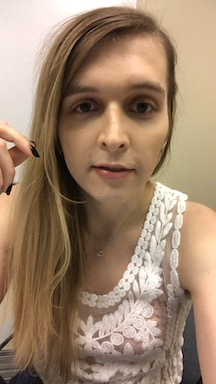

*   I was born in Queens, New York, and I moved around the NYC area for most of my childhood. 
*   I am also a citizen of Poland and spent my summers there with the rest of my family who lives there. 
*   I love to buy, cook, and talk about food. I am always excited for something food related so definitely feel free to ask me about anything food related :)
*   I play a lot of PC games, recently been playing Monster Train, Valorant, Neversong, and right now I am playing Persona 4! 
*   I am overall new to tech, my undergraduate degree is in Philosophy and I worked for a few years in education, law, and nonprofit companies. I really enjoyed teaching and plan to circle back to it later. 
*   I love dogs, and have had the honor of raising a few. I definitely plan to continue fostering and eventually plan to adopt a dog again!!! I like all dogs but big dogs are my favorite. 
*   Also I am recently really into buying flowers, even though I know almost nothing about flowers :)
*   I watch Twitch.tv everyday, Lirik is my favorite streamer!
*   I think more beverages should be spicy.
*   I am a very social person and love to chat, definitely feel free to contact me on any of the platforms we have even just to chat! 

